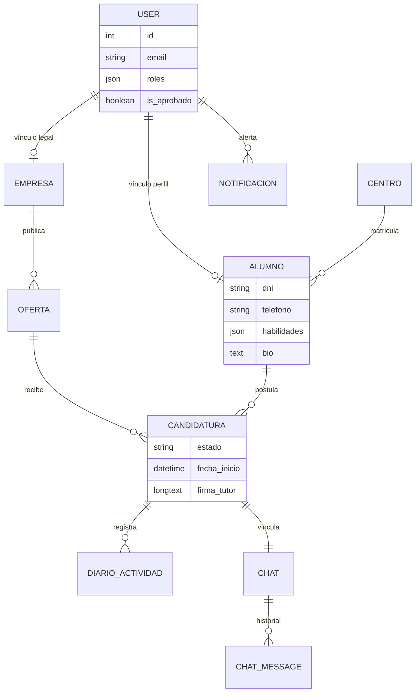

# Documentación Técnica Maestra: EDUCONECT [RC 1.3]

## 1. Introducción y Justificación Académica
**EduConect** es una solución tecnológica integral para la gestión del módulo de **Formación en Centros de Trabajo (FCT)**. Su propósito es digitalizar el ecosistema de prácticas, eliminando la dependencia del papel y centralizando la comunicación entre Alumnos, Centros Educativos y Empresas.

### 1.1. Stack Tecnológico Detallado
Para garantizar un rendimiento óptimo, escalabilidad y una experiencia de usuario de alta fidelidad, **EduConect** se apoya en un ecosistema de herramientas de vanguardia:

*   **Frontend (SPA)**:
    *   **React 18+ & TypeScript**: Arquitectura basada en componentes con tipado estricto para minimizar errores en tiempo de ejecución.
    *   **Vite**: Motor de construcción de próxima generación que acelera el ciclo de desarrollo y optimiza el bundle de producción.
    *   **Framer Motion**: Motor de animaciones utilizado para las transiciones de página, feedbacks visuales y micro-interacciones "premium".
    *   **Estilizado**: Uso de **Vanilla CSS** y **Tailwind CSS** para componentes personalizados con efectos de *Glassmorphism* y diseño responsivo.
    *   **Material Symbols**: Sistema de iconografía vectorial moderno y consistente para una navegación intuitiva.

*   **Backend (API Restful)**:
    *   **PHP 8.2+**: Uso de las últimas funcionalidades del lenguaje (Readonly properties, Enums, Attributes) para un código limpio y eficiente.
    *   **Symfony 6.4 / 7 (LTS)**: Framework de alto rendimiento que proporciona una base sólida para la seguridad, el routing y la inyección de dependencias.
    *   **Doctrine ORM**: Capa de abstracción de base de datos para una gestión robusta del modelo relacional.
    *   **MySQL / MariaDB**: Motor de base de datos relacional elegido por su fiabilidad en la gestión de integridad referencial.

*   **Servicios y Librerías Core**:
    *   **DomPDF**: Motor de renderizado de HTML a PDF para la formalización digital de convenios y anexos.
    *   **LexikJWTAuthentication**: Implementación de seguridad basada en tokens JWT para una comunicación *stateless* y segura.
    *   **Axios**: Cliente HTTP para la gestión de peticiones asíncronas entre el cliente y el servidor.

---

## 2. Arquitectura de Datos (Modelo Relacional Detallado)

### 2.1. Entidades de Dominio (Vista de Negocio)
| Entidad | Campos Clave | Relaciones | Propósito |
| :--- | :--- | :--- | :--- |
| **User** | `id`, `email`, `roles`, `password`, `nombre`, `foto`, `isAprobado` | 1:1 Alumno/Empresa | Identidad y RBAC. |
| **Alumno** | `dni`, `telefono`, `cv_path`, `habilidades` (JSON), `bio` | N:1 Centro | Perfil del estudiante y marca personal. |
| **Empresa** | `cif`, `logo`, `web`, `sector`, `ubicacion`, `beneficios` | 1:N Oferta | Perfil corporativo. |
| **Centro** | `nombre`, `direccion`, `contacto` | 1:N Alumno | Institución educativa. |
| **Oferta** | `titulo`, `descripcion`, `tecnologias`, `plazas` | N:1 Empresa | Vacantes de prácticas. |
| **Candidatura**| `estado`, `fecha_inicio`, `fecha_fin`, `firma_tutor_centro`, `firma_tutor_empresa` | N:1 Alumno/Oferta | Gestión del ciclo FCT. |
| **DiarioActividad**| `fecha`, `horas`, `descripcion`, `estado_validacion` | N:1 Candidatura | Bitácora de formación. |
| **Notificacion** | `mensaje`, `tipo_evento`, `context_url`, `is_leido` | N:1 User | Alertas y Deep Linking. |
| **Chat** | `id`, `nombre`, `candidatura_id` | 1:N Mensajes | Canal de comunicación bidi. |
| **ChatMessage** | `contenido`, `fecha_envio`, `leido_por` (JSON) | N:1 Chat | Registro de mensajes. |

### 2.2. Esquema Físico (Implementación SQL)
El sistema utiliza una base de datos relacional (MySQL/MariaDB) con tipos de datos avanzados para una gestión flexible:

*   **`user`**: Almacena credenciales y roles. El campo `roles` es de tipo `JSON`. Incluye `is_aprobado` (Boolean) para el control de acceso administrativo.
*   **`alumno`**: Vincula a `user` mediante una FK. Gestiona el `dni` (Unique), `telefono`, `habilidades` (JSON) y `bio` (Text) para el extracto profesional.
*   **`empresa`**: Almacena el `cif` y metadatos de branding. Los campos `tecnologias` y `beneficios` son `JSON` para facilitar la extensibilidad de etiquetas.
*   **`candidatura`**: La tabla más compleja. Almacena `firma_tutor_centro` y `firma_tutor_empresa` como `LONGTEXT` (alojando las rúbricas en Base64). Relaciona alumnos con ofertas y tutores asignados.
*   **`diario_actividad`**: Registro diario con `fecha` (Date), `horas` (Float) y `estado` (Enum: PENDIENTE/APROBADO/RECHAZADO).
*   **`chat` / `chat_message`**: Estructura de mensajería con soporte para estados de lectura mediante arrays JSON de usuarios que han visto el mensaje.

### 2.3. Arquitectura de Estados de la Candidatura
La entidad `Candidatura` actúa como el motor de estados del proyecto, gobernando la transición desde la postulación inicial hasta la finalización de la FCT mediante un flujo lógico de validaciones:

1.  **POSTULADO** (Estado Inicial): El **Alumno** envía su solicitud a una oferta. La documentación y el diario de actividades permanecen bloqueados.
2.  **ADMITIDO** (Selección): La **Empresa** revisa el perfil y el CV, aceptando formalmente al candidato. El sistema dispara una notificación al Tutor de Centro para la validación académica.
3.  **VALIDADO** (Formalización): El **Tutor de Centro** define las fechas de ejecución, la jornada y aporta su firma digital. **Este es el hito crítico donde nace el Convenio**, se activan los canales de chat y se habilita el calendario de fichaje.
4.  **FINALIZADO** (Cierre): Estado alcanzado una vez completadas las **370 horas** lectivas o expirado el plazo temporal definido en el convenio.


### 2.4. Diagrama Entidad-Relación (Visión Técnica)
Para comprender la integridad referencial del sistema, se presenta el esquema de relaciones que gobierna la persistencia de datos:



---

## 3. Catálogo de Endpoints (API REST)

### 🔑 Autenticación y Perfil
*   `POST /api/login`: Generación de token JWT.
*   `POST /api/register`: Registro dinámico por rol.
*   `POST /api/forgot-password`: Inicio de flujo de recuperación.
*   `GET /api/me`: Obtención de datos del usuario actual.

### 💬 Sistema de Chat (Mensajería)
*   `POST /api/chat/list`: Listado de canales activos por usuario.
*   `GET /api/chat/{id}/messages`: Recuperación de hilos de conversación.
*   `POST /api/chat/{id}/send`: Envío de mensajes y archivos adjuntos.
*   `DELETE /api/chat/message/{id}`: Borrado físico de mensajes propios.

### 🎓 Gestión del Alumno
*   `GET /api/alumno/ofertas`: Marketplace de vacantes disponibles.
*   `POST /api/alumno/postular`: Creación de candidatura.
*   `POST /api/alumno/diario`: Registro de horas.
*   `GET /api/alumno/progreso`: Cálculo de las 370h.

### 🏢 Gestión de Empresa
*   `POST /api/empresa/ofertas/create`: Publicación de vacantes.
*   `GET /api/empresa/candidatos`: Listado de postulantes.
*   `POST /api/empresa/profile/update`: Branding corporativo.
*   `POST /api/empresa/tutor/aprobar`: Validación de mentores.

### ✍️ Flujo Documental (Convenios)
*   `POST /api/candidatura/{id}/firmar`: Recepción de firma Base64.
*   `GET /api/candidatura/{id}/pdf`: Generación de convenio con DomPDF.

---

## 4. Identidad Visual y Diseño Académico

La interfaz de **EduConect** ha sido diseñada bajo una filosofía de **"Modern Learning Environment"**, priorizando la legibilidad, la jerarquía visual y una estética premium que transmita confianza y profesionalidad.

### 🎨 Paleta de Colores (Brand Colors)
Se ha implementado una paleta basada en el espectro **Indigo-Blue**, asociada tradicionalmente a la tecnología y la educación superior:

*   **Color Primario (`#4F46E5`)**: El motor visual del sistema. Aplicado en botones de acción y estados activos.
*   **Color Acento (`#10B981`)**: Verde esmeralda para validaciones, estados de "Aprobado" y feedback positivo.
*   **Fondos Contrastados**: Snow Blue (`#F8FAFF`) para claridad y Deep Slate (`#0F172A`) para el modo oscuro.

### 📐 Tipografía y Jerarquía
La coherencia tipográfica se apoya en dos fuentes de **Google Fonts**:
*   **Outfit (Display)**: Para titulares y grandes indicadores numéricos. Su geometría circular aporta modernidad y limpieza.
*   **Inter (Body)**: Para textos densos y datos técnicos. Elegida por su altísima legibilidad en pantallas de alta resolución.

### 💎 Estilos y Efectos Core
*   **Glassmorphism (Efecto Cristal)**: Uso de `backdrop-blur` con opacidades del 70%, permitiendo que la interfaz se sienta ligera y espacial.
*   **Bordes Orgánicos**: Implementación de radios de curvatura amplios (`2rem` a `3rem`) para alejarse de la rigidez administrativa.
*   **Gradientes Dinámicos**: Uso de transiciones lineales `Indigo -> Blue` en textos y componentes interactivos.
*   **Micro-copywriting**: Textos de ayuda y placeholders persuasivos en campos como el "Extracto Profesional" para incentivar la calidad del perfil.

---

## 5. Ciclo de Vida y Flujo Operativo de la FCT

EduConect gestiona una jerarquía estricta de validaciones para garantizar la integridad de los datos académicos y laborales. El flujo se divide en cuatro fases críticas:

### 5.1. Inicialización de Instituciones (SuperAdmin)
*   **Configuración Base**: El **Super Administrador** es el primer actor en intervenir, dando de alta los Centros Educativos en el sistema y definiendo su oferta de Grados Superiores/Titulaciones. Sin este paso, ningún otro actor puede vincularse a una institución.

### 5.2. Gobernanza Académica (Tutor de Centro y Alumno)
1.  **Registro de Tutor**: El **Tutor de Centro** se registra seleccionando su Instituto y Grado correspondiente.
2.  **Validación de Tutor**: El **SuperAdmin** debe aprobar manualmente la cuenta del tutor para verificar su identidad institucional. Solo tras esto, el tutor puede operar.
3.  **Registro de Alumno**: El **Alumno** se registra y elige a su tutor (ya verificado) como mentor académico.
4.  **Activación de Alumno**: El **Tutor de Centro** debe admitir y validar al alumno para confirmar su matrícula. Hasta que el tutor no valida al alumno, este no tiene acceso a las funcionalidades del dashboard.

### 5.3. Estructura Corporativa (Empresa y Mentor Laboral)
1.  **Perfil Empresa**: La **Empresa** se registra y completa su perfil corporativo (branding y datos legales).
2.  **Registro de Mentor**: El **Tutor de Empresa** se registra vinculándose a la empresa creada anteriormente.
3.  **Aprobación Interna**: La **Empresa** debe validar a su tutor de empresa. Una vez aprobado, el tutor laboral puede iniciar sesión y gestionar estudiantes.

### 5.4. Proceso de FCT y Formalización Digital
1.  **Marketplace**: La Empresa publica una oferta; el Alumno postula a través de su panel.
2.  **Selección**: La Empresa valida al alumno tras revisar su perfil y CV.
3.  **Validación Académica**: El **Tutor de Centro** valida la idoneidad de la empresa para ese alumno concreto y procede a la firma digital del convenio.
4.  **Rúbrica Final**: El **Tutor de Empresa** firma el documento digitalmente.
5.  **Generación de Convenio**: El sistema genera el documento legal definitivo (módulo Papel Cero).
6.  **Seguimiento Diario**: Una vez generado el convenio, se activa automáticamente el **Calendario de Prácticas**, permitiendo al alumno realizar el "fichaje" de horas y la descripción de tareas diarias.

---

## 6. Interfaz de Usuario: Portal de Entrada (Home)

La página de inicio de **EduConect** no es solo una landing page, sino un motor de segmentación inteligente diseñado para guiar a los tres actores principales hacia sus flujos de trabajo específicos.

### 6.1. Componentes de Alta Fidelidad
*   **Sticky Header (Glassmorphism)**: Implementación de un encabezado dinámico con `backdrop-blur` que ajusta su opacidad y altura mediante estados de React al detectar el scroll del usuario.
*   **Scroll Progress Indicator**: Barra de progreso superior animada con **Framer Motion** (`scrollYProgress`) que proporciona feedback visual sobre la profundidad de la lectura.
*   **Hero Section Dinámica**: Uso de gradientes animados y "blobs" decorativos con desenfoque gaussiano para crear una atmósfera tecnológica y profesional.

### 6.2. Estrategia de Onboarding por Rol
La Home segmenta la propuesta de valor en tres ejes:
*   **Talento Joven (Alumnos)**: Foco en el marketplace de ofertas y la eliminación del papel en el diario de prácticas.
*   **Eficiencia Docente (Centros)**: Centralización de firmas digitales y supervisión masiva de expedientes.
*   **Captación Corporativa (Empresa)**: Herramientas de branding y acceso directo a perfiles técnicos cualificados.

---

## 7. Ecosistema de Dashboards: Centros Operativos

EduConect despliega cuatro interfaces especializadas, diseñadas para las necesidades críticas de cada rol, compartiendo una estética coherente de alta fidelidad.

### 7.1. Dashboard del Alumno (Gestión de Carrera)
*   **Mi Panel Educativo (`dashboard`)**: Vista 360º del estado académico, progreso del convenio y notificaciones urgentes.
*   **Mercado de Prácticas (`search`)**: Motor de búsqueda de ofertas laborales y gestión de candidaturas enviadas.
*   **Bitácora Diario (`diario`)**: Calendario interactivo para el registro detallado de tareas, horas y modalidad.
*   **Canal Mensajes (`messages`)**: Chat en tiempo real con tutores de centro y empresa.

### 7.2. Dashboard de Empresa (Captación y Branding)
*   **Panel de Control (`dashboard`)**: Analítica de visibilidad, conversión de talento y KPIs operativos.
*   **Gestión de Vacantes (`ofertas`)**: Listado histórico de ofertas con control de estados y edición dinámica.
*   **Gestión de Candidatos (`candidatos`)**: Pipeline de recursos humanos para validar perfiles y revisar CVs.
*   **Nueva Oferta (`nueva_oferta`)**: Editor visual para el lanzamiento de nuevas oportunidades en el sistema.
*   **Gestión de Tutores (`tutores`)**: Auditoría y aprobación de mentores laborales vinculados a la organización.
*   **Perfil Corporativo (`perfil`)**: Centro de branding corporativo, tecnologías y beneficios sociales.

### 7.3. Dashboard del Tutor de Centro (Supervisión Académica)
*   **Panel General (`resumen`)**: Vista consolidada del estado del centro y alertas de firmas pendientes.
*   **Inscripciones (`solicitudes`)**: Módulo de validación de acceso para nuevos estudiantes registrados.
*   **Alumnado (`alumnos`)**: Inventario completo de alumnos con acceso a expedientes y bitácoras de seguimiento.
*   **Mensajería (`mensajes`)**: Centro de chat dedicado a la coordinación con tutores laborales y alumnos.
*   **Red de Empresas (`empresas`)**: Directorio de partners colaboradores vinculados al centro educativo.
*   **Normativa (`documentacion`)**: Repositorio de leyes y guías para la gestión administrativa de la FCT.

### 7.4. Dashboard del Tutor de Empresa (Mentoring Laboral)
*   **Resumen (`resumen`)**: KPIs rápidos sobre alumnos asignados y estados de validación documental.
*   **Tus Alumnos (`alumnos`)**: Lista de estudiantes bajo tutorización con herramientas de firma y visualización de diarios.
*   **Mensajería (`mensajes`)**: Canal bidireccional de chat para la resolución de dudas operativas del día a día.

---

## 8. Formalización del Convenio (Firma Digital y Anexo FCT)

El núcleo legal de EduConect es su motor de formalización de convenios, que transforma un acuerdo digital en un documento PDF vinculante con firmas electrónicas integradas.

### 8.1. Flujo de Validación y Firma Bi-Fase
Para asegurar el cumplimiento de la normativa académica, el sistema impone un orden secuencial de firmas:

1.  **Firma Académica (Tutor de Centro)**:
    *   **Acción**: Define fechas exactas (Inicio/Fin), tipo de jornada y duración.
    *   **Captura**: Rúbrica manual mediante el componente `SignaturePad`.
    *   **Transición**: La candidatura pasa a un estado de bloqueo operativo hasta que la empresa firma.
2.  **Firma Laboral (Tutor de Empresa)**:
    *   **Acción**: Revisa los términos establecidos por el centro y aporta su rúbrica digital.
    *   **Activación**: Al completar este paso, el estado cambia a `VALIDADO`, activando automáticamente el calendario de fichaje del alumno.

### 8.2. Generación Automatizada del PDF (DomPDF)
Una vez formalizado, el sistema utiliza el motor **DomPDF** en el backend para generar el Anexo oficial:
*   **Incrustación de Rúbricas**: Las firmas capturadas en formato `Base64` se instancian dinámicamente en el pie del documento.
*   **Seguridad Documental**: Cada convenio cuenta con un **ID de Transacción único** (MD5 Hash) basado en los metadatos de la candidatura para prevenir falsificaciones.
*   **Accesibilidad**: El alumno puede descargar el documento en cualquier momento desde su dashboard para trámites externos o seguro escolar.

### 8.3. Desencadenadores Post-Firma (Automaciones)
La validación final dispara tres procesos críticos:
*   **Chat de Seguimiento**: Creación automática del canal tripartito (Alumno + Tutor Centro + Tutor Empresa).
*   **Habilitación de Bitácora**: Apertura del calendario para el registro de tareas diarias.
*   **Notificación Masiva**: Alerta a todos los actores involucrados de que la FCT ha comenzado oficialmente.

### 8.4. Lógica de "Papel Cero" (Proceso Técnico de la Rúbrica)
La digitalización completa de la FCT se apoya en un flujo de datos que elimina la necesidad de impresión física. Este proceso técnico se desglosa en tres capas fundamentales:

1.  **Captura en Frontend (Canvas API)**:
    *   El componente `SignaturePad` utiliza la API de Canvas de HTML5 para registrar las coordenadas del cursor o del rastro táctil en tiempo real.
    *   Mediante el método `toDataURL('image/png')`, el trazo se convierte en una cadena de texto **Base64**, que codifica la imagen de la rúbrica con canal alfa (transparencia).

2.  **Transmisión y Persistencia**:
    *   La cadena Base64 se envía al backend de Symfony mediante una petición `POST` asíncrona.
    *   En la base de datos, estas rúbricas se almacenan en la entidad `Candidatura` dentro de campos de tipo `LONGTEXT` (`firma_tutor_centro` y `firma_tutor_empresa`), garantizando que la firma quede vinculada de forma unívoca a la relación contractual.

3.  **Reconstrucción Documental Dinámica (DomPDF)**:
    *   Al solicitar el convenio, el `CandidaturaManager` recupera las cadenas Base64 y las inyecta en una plantilla Twig diseñada según los estándares institucionales.
    *   En el código HTML de la plantilla, las firmas se renderizan dinámicamente: ``.
    *   Finalmente, **DomPDF** procesa el documento y lo transforma en el archivo binario PDF definitivo, incrustando la firma como un elemento gráfico no editable.

---

## 9. Sistema de Notificaciones Inteligentes

EduConect implementa un ecosistema de alertas proactivas que garantiza que ningún actor pierda eventos críticos en el ciclo de la FCT.

### 9.1. Arquitectura Full-Stack
*   **Modelo de Datos (Backend)**: Basado en la entidad `Notificacion`, que almacena metadatos como `tipo` (success, danger, neutral), `título`, `descripción`, e `iconos` vectoriales de Material Symbols.
*   **Sincronización Proactiva (Frontend)**: El componente `NotificationPanel` utiliza un mecanismo de **Polling optimizado** (cada 30 segundos) para consultar el endpoint `/api/notificaciones`, asegurando que el usuario reciba feedback casi en tiempo real sin recargar la página.

### 9.2. Lógica de Interacción
1.  **Generación de Eventos**: El sistema crea notificaciones automáticas ante hitos clave:
    *   *Alumno postula a una oferta.*
    *   *Empresa valida a un candidato.*
    *   *Tutor firma un convenio digital.*
    *   *SuperAdmin aprueba un centro o tutor.*
2.  **Visualización Condicionada**: Cada notificación está tipada por gravedad (Success, Danger o Neutral) y cuenta con una acción directa (`CTA`) para resolver el evento notificado.
3.  **Gestión Stateless**: El usuario puede marcar notificaciones como leídas, lo que dispara un evento `POST` al servidor para persistir el estado y mantener la bandeja de entrada limpia.

---

## 10. Centro de Mensajería (Chat Corporativo)

El sistema de chat permite una comunicación fluida y documentada entre todos los actores de la FCT.

### 10.1. Características Técnicas
*   **Canales Dinámicos**: Se crean automáticamente al formalizar una tutoría o candidatura.
*   **Sincronización Polling (5s)**: Sincronización rápida para una experiencia de chat cercana al tiempo real.
*   **Doble Check de Lectura**: Implementado mediante un campo JSON en base de datos que rastrea qué IDs de usuario han visualizado cada mensaje.

### 10.2. Funcionalidades Premium UI/UX
*   **Gestión de Mensajes**: Menú contextual para eliminar mensajes enviados por error.
*   **Multimedia**: Soporte para adjuntar archivos y selector de emojis integrado.
*   **Accesibilidad**: Ajuste dinámico del tamaño de fuente para mejorar la legibilidad.
*   **Estética de Burbuja**: Diseño diferenciado para remitente/destinatario con gradientes visuales.

### 10.3. Estrategia de Sincronización (Justificación Técnica)
A diferencia de arquitecturas basadas en WebSockets o Mercure, EduConect implementa una estrategia de **Standard Polling** proactiva, calibrada para equilibrar la experiencia de usuario y la carga del servidor:

*   **Intervalos Optimizados**: Se han definido ciclos de **5 segundos para el chat** (proporcionando una sensación de fluidez casi instantánea) y **30 segundos para las notificaciones globales**.
*   **Compatibilidad de Hosting**: Esta decisión técnica garantiza que la plataforma sea 100% funcional en servidores de hosting estándar y entornos compartidos, eliminando la necesidad de servicios de mensajería externos o configuraciones de servidor complejas (daemons/root access).
*   **Robustez y Simplicidad**: Facilita el despliegue en infraestructuras de centros educativos, asegurando que el sistema sea estable, fácil de auditar y con un mantenimiento técnico mínimo.

---

## 11. Gestión de Perfiles y Marca Personal

EduConect permite a los usuarios gestionar su identidad digital de manera granular para maximizar la empleabilidad y el branding corporativo.

### 11.1. Perfil del Alumno (Identidad Profesional)
*   **Curriculum Vitae (PDF)**: Sistema de carga y almacenamiento asíncrono de CVs para que las empresas puedan descargarlos durante el proceso de selección.
*   **Habilidades (Tags)**: Gestión dinámica de competencias técnicas (ej: React, Docker, Python) mediante un sistema de etiquetas interactivas.
*   **Identidad Visual**: Personalización de la foto de perfil con procesamiento en servidor y actualización instantánea del avatar en todos los dashboards.
*   **Extracto Profesional (Bio)**: Editor de biografía integrada para que el alumno defina sus metas y propuesta de valor, visible instantáneamente para reclutadores y tutores.
*   **Información Académica**: Sincronización transparente con el Centro y Grado asignado.

### 11.2. Perfil de Empresa (Corporate Branding)
*   **Presencia Web y Social**: Campos específicos para URL corporativa, LinkedIn e Instagram, facilitando la investigación por parte del alumno.
*   **Stack Tecnológico**: Definición de las tecnologías core empleadas en la empresa para atraer perfiles especializados.
*   **Beneficios del Centro**: Gestión de una lista de valores añadidos (ej: Fruta en la oficina, Teletrabajo, Formación) para mejorar el atractivo de las ofertas.
*   **Gestión de Logotipo**: Soporte para formatos transparentes (PNG/SVG) para una integración perfecta con la interfaz *Glassmorphism*.

---

## 12. Sistema de Seguimiento Diario (Calendario de FCT)

El módulo de seguimiento es el núcleo operativo de la formación, donde se registra y valida la actividad diaria del alumno.

### 12.1. Diario de Actividades (Alumno)
*   **Registro de Jornadas**: El alumno registra sus tareas diarias especificando la modalidad (Presencial/Teletrabajo) y una descripción detallada.
*   **Validación de Festivos**: El sistema integra el calendario laboral de **Andalucía 2026**, bloqueando automáticamente el registro en días no lectivos para evitar errores administrativos.
*   **Contador de Progreso**: Visualización en tiempo real del acumulado de horas validadas frente al objetivo oficial de **370 horas**.

### 12.2. Panel de Validación (Tutores)
*   **Calendario Visual**: Interfaz de cuadrícula mensual con códigos de colores por estado:
    *   **Gris**: Sin actividad registrada.
    *   **Azul**: Pendiente de revisión.
    *   **Verde**: Jornada aprobada.
    *   **Rojo**: Festivo nacional/regional.
*   **Acciones de Auditoría**: El tutor puede aprobar o rechazar entradas individuales, permitiendo añadir observaciones de retroalimentación en caso de rechazo para que el alumno corregía la entrada.

---

## 13. Características Distintivas (User Experience)

*   **SignaturePad**: Componente de captura de firmas basado en Canvas API para persistencia de rúbricas legales.
*   **Gestión de Archivos**: Almacenamiento seguro de currículums (PDF) y firmas vectoriales en el servidor.
*   **Calendario Inteligente**: Control de asistencia integrado con festivos locales para validación de jornadas.
*   **Notification Hub**: Alertas en tiempo real con soporte para **Deep Linking** a acciones críticas.
*   **Modo Oscuro Integrado**: Persistencia de preferencia de tema mediante Context API y `localStorage`.

---

## 14. Seguridad y Robustez Técnica

*   **JWT Stateless**: Autenticación sin sesiones en servidor mediante JSON Web Tokens.
*   **Password Hashing**: Uso de **Argon2id** (Algoritmo de alta resistencia recomendado por OWASP).
*   **CORS Policy**: Configuración restringida para asegurar la comunicación solo entre dominios autorizados.
*   **Input Validation**: Tipado estricto en el frontend y validación de esquemas en el backend.
*   **RBAC**: Control de acceso basado en roles con jerarquía estricta gestionada por Symfony Security.

### 14.1. Implementación de RBAC (Role-Based Access Control)
El sistema garantiza que cada actor solo interactúe con los datos que le corresponden mediante una jerarquía de roles gestionada en dos niveles:

*   **Protección en Servidor (`security.yaml`)**: Mediante la configuración de `access_control`, se restringen los endpoints de la API. Symfony intercepta cada llamada, verifica la validez del token y asegura que el usuario posea los privilegios necesarios (ej: `ROLE_TUTOR_CENTRO`, `ROLE_EMPRESA`, etc.) antes de ejecutar la lógica del controlador.
*   **Payload JWT Dinámico**: El token generado por el servidor no solo identifica al usuario, sino que transporta sus roles de forma cifrada. Esto permite una arquitectura *stateless* donde la autorización es inmediata y segura.

### 14.2. Seguridad Sensible en el Frontend
La interfaz de usuario es consciente del nivel de acceso del usuario para una experiencia limpia y protegida:

*   **Persistencia en UserContext**: Tras el login, React decodifica el payload del JWT y propaga los roles a través de un Context API global.
*   **Renderizado Condicional de Dashboards**: Los layouts y barras de navegación se filtran dinámicamente. Si un alumno intenta acceder a una URL de tutor, el sistema lo reconduce automáticamente (Route Guards), y las pestañas de gestión empresarial ni siquiera se renderizan en su interfaz.

---

## 15. Arquitectura de Directorios (Folder Tree)
Para facilitar el mantenimiento y la escalabilidad del proyecto, se ha seguido una estructura modular que separa claramente las responsabilidades:

### 📂 Organización de Raíz (Root Structure)
*   **`/docs`**: Repositorio central de documentación técnica, memorias académicas y manuales.
*   **`/scripts`**: Ecosistema de automatización en Python para la gestión del despliegue y mantenimiento del entorno de producción.
*   **`/backups`**: Almacenamiento de archivos históricos, volcados de base de datos y paquetes de despliegue anteriores.

### 📂 Frontend (React + TypeScript)
*   **`src/context`**: Gestión del estado global mediante **Context API** (ej: `UserContext` para el flujo de sesión).
*   **`src/pages`**: Vistas core de la aplicación (Dashboards específicos por rol y Registro Dinámico).
*   **`src/components`**: Componentes reutilizables de alta fidelidad (Modales de firma, Chat, Paneles de Notificación).

### 📂 Backend (Symfony)
*   **`src/Controller/Api`**: El "puente" de datos; endpoints que gestionan la comunicación REST con el cliente.
*   **`src/Service`**: Capa de lógica de negocio pesada (ej: `CandidaturaManager` para la orquestación de firmas y generación de PDF).
*   **`src/Entity`**: Definición del modelo relacional orientado a objetos.

---

## 16. Mantenimiento y Operativa (CLI)

El backend incluye comandos Symfony personalizados para la gestión del sistema:
*   `php bin/console app:list-users`: Auditoría de usuarios registrados en el sistema.
*   `php bin/console app:debug:tutors`: Resolución de conflictos en las asignaciones de tutores y centros.
*   `php bin/console app:generate:test-data`: Poblado automático de la base de datos con perfiles de prueba (Alumnos, Empresas, Ofertas) para demostraciones y QA.
*   `php bin/console app:clean:notifications`: Purga de alertas antiguas para mantener la agilidad del sistema de polling.

### 🛠️ Mantenimiento en Producción (Alwaysdata)
Para aplicar cambios de esquema o limpiar el sistema en el entorno real, es imperativo usar el flag de entorno:
*   `php bin/console cache:clear --env=prod`: Reconstruye el contenedor de servicios y metadatos de producción. **Obligatorio tras cada despliegue.**
*   `php bin/console doctrine:schema:update --force --env=prod`: Sincroniza la estructura de la base de datos real con las entidades PHP.
*   `php bin/console dbal:run-sql "SELECT..."`: Ejecutor de consultas SQL directas para auditoría rápida sin salir de la terminal.

### 🐍 Scripts de Automatización (Python / Paramiko)
Para garantizar una alta disponibilidad en el entorno de producción (**Alwaysdata**), se han desarrollado scripts de gestión remota mediante SSH/SFTP:
*   **`final_fix.py`**: Automatización del setup inicial en producción (Configuración de `.env.local`, ejecución de migraciones y creación del SuperAdmin inicial).
*   **`total_deploy.py` / `upload_deploy.py`**: Pipeline de despliegue simplificado para sincronizar cambios locales con el servidor remoto.
*   **`fix_remote.py` / `fix_env.py`**: Herramientas de diagnóstico para la resolución de errores de conexión y regeneración de caché/claves en producción.

---

## 17. Guía de Instalación Pro

### Entorno de Desarrollo
```bash
# 1. Backend
composer install
php bin/console lexik:jwt:generate-keypair
php bin/console doctrine:migrations:migrate

# 2. Frontend
npm install
npm run dev
```

### Despliegue en Entorno de Producción (Arquitectura Híbrida)
La plataforma se aloja sobre una infraestructura de alta disponibilidad, separando el ecosistema Frontend del Backend para maximizar la escalabilidad y seguridad.

**1. Frontend (SPA): Google Firebase Hosting**
Aplicación estática servida globalmente mediante CDN con certificados SSL automatizados.
*   **URL de Producción en Vivo**: [https://educonect-app.web.app](https://educonect-app.web.app)

**2. Backend & Base de Datos: Alwaysdata**
Servidor dedicado estructurado para aplicaciones empresariales, proveyendo soporte nativo para **PHP 8.2**, **Symfony 7** y **MySQL**. Hospeda la lógica RESTful y el almacenamiento físico (blobs de firmas, documentos generados y esquema relacional).

#### Operativa de Actualización (Deploy)
Tras realizar cambios en local, los comandos de paso a producción aplicados son los siguientes:

```bash
# -- Actualización DUAL de Producción --

# 1. Despliegue del Frontend (Local -> Firebase)
cd frontend
npm run build 
npx firebase-tools deploy --only hosting --project educonect-app

# 2. Despliegue del Backend (En servidor Alwaysdata vía SSH)
cd /www/backend
git pull origin main
composer install --no-dev --optimize-autoloader
php bin/console doctrine:migrations:migrate --no-interaction
php bin/console cache:clear --env=prod
```
---

## 18. Cronograma de Desarrollo (Fases del Proyecto)
El éxito de **EduConect** se sustenta en un desarrollo metódico dividido en cinco fases estratégicas, todas completadas satisfactoriamente:

*   **🟢 Fase 1: Cimientos y Arquitectura**: Configuración del stack (Symfony 7 + React 18), diseño del modelo relacional y seguridad JWT.
*   **🟢 Fase 2: Portales de Gestión Escolar**: Registro dinámico, dashboards de tutor/alumno y el núcleo del Diario de Actividades.
*   **🟢 Fase 3: Marketplace y Convenio Digital**: Sistema de ofertas FCT, gestión de candidaturas y firma electrónica mediante `SignaturePad`.
*   **🟢 Fase 4: Gobernanza y Administración**: Panel de SuperAdmin, sistema global de notificaciones y recuperación de credenciales.
*   **🟢 Fase 5: UX Premium y Comunicación**: Chat bidireccional, pulido estético (Glassmorphism), animaciones y documentación final.

---

## 19. Auditoría y Optimización de Rendimiento (Performance Core)

Para garantizar la viabilidad del proyecto en entornos de producción con alta concurrencia, se ha documentado y ejecutado una auditoría estructural focalizada en la eficiencia de datos y la reducción de latencia del servidor en su despliegue híbrido.

### 19.1. Segregación de Metadatos Pesados (BLOBs)
Para erradicar la sobrecarga de RAM generada por Doctrine ORM, se ha aplicado un patrón de segregación. Los datos masivos en Base64 de las rúbricas se han extraído de la entidad primaria para encapsularse en una nueva entidad 1:1, **`CandidaturaFirma`**. Al definirse como el *Owning Side* de la relación con carga diferida (`fetch="LAZY"`), se evita de raíz que procesos de listado carguen inútilmente megabytes de información gráfica en memoria que solo compete renderizar al generar un documento en PDF.

### 19.2. Mitigación de Saturación por Polling (Caché HTTP)
El componente `ChatController` consumía severos ciclos del motor MySQL a causa del *Short Polling* de React. Se ha implementado un mecanismo de sincronización condicional inyectando cabeceras **ETags**. El backend genera un certero hash MD5 mediante un ultra-ligero `MAX()` / `COUNT()` en la tabla *ChatMessage* en vez de hidratar entidades de Doctrine. Cuando el cliente consulta la ruta y el bloque se mantiene inalterado, Symfony cortocircuita y despacha una cabecera HTTP **304 Not Modified**, salvando el ancho de banda y apagando el re-renderizado inerte. 

### 19.3. Erradicación de N+1 Queries (DQL Join Fetch)
Se ha auditado profundamente la capa de persistencia en Repositorios clave (`CandidaturaRepository`, `AlumnoRepository`) donde las cargas de dashboards multidimensionales sufrían del lastre derivado de las llamadas perjudiciales de las llamadas "N+1". La arquitectura se ha reconducido implementando consultas complejas utilizando el `QueryBuilder` combinando estratégicamente sentencias `addSelect()` con `innerJoin()`. Esto desploma el volumen de peticiones enviadas al SGBD, transformando esquemas que antes dilataban ~150 queries en 1 sola mega-consulta altamente pre-compilada.

---


---
**EduConect — 2026**
*Proyecto Final de Grado Superior en Desarrollo de Aplicaciones Web (DAW)*
